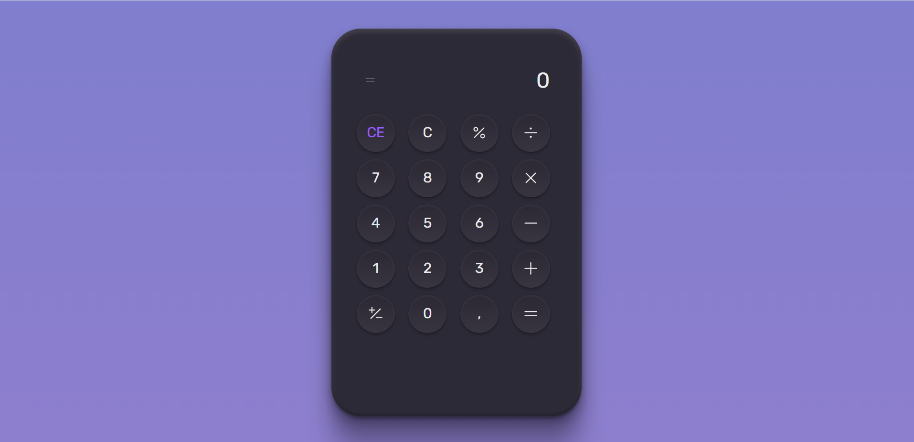

# CalculadoraRocketseat

Projeto de uma calculadora simples usando html, css e jquery.

Esse projeto foca em praticar mais o uso de JavaScript e Css.
Na lógica dessa calculadora foi utilizado JQuery para facilitar as devidas manipulações.
O css é a base para a estilização da calculadora.
